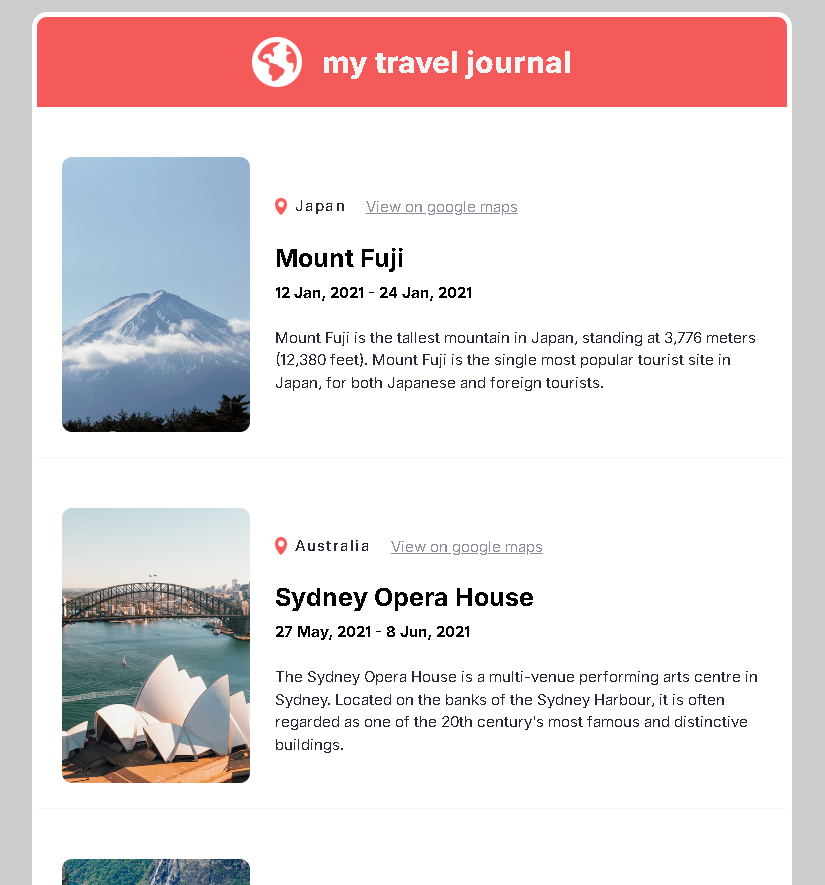

# 🌍 Travel Journal (React)

A modern, responsive **Travel Journal web app** built with **React**.
This project displays travel destinations using reusable components and dynamic data rendering.

Inspired by a Figma design, this app focuses on **component-based architecture**, **props usage**, and **clean UI implementation**.

---

## 🚀 Features

* 📌 Reusable React components (Header, TravelCard, MainContent)
* 🧩 Dynamic rendering using `.map()`
* 🖼️ Image handling with props
* 🌐 External links (Google Maps integration)
* 🎨 Clean UI inspired by Figma design
* ⚡ Built with Vite for fast performance

---

## 🛠️ Tech Stack

* **React (Vite)**
* **JavaScript (ES6+)**
* **CSS3**
* **Figma (Design Reference)**

---

## 📂 Project Structure

```id="a1b2c3"
src/
│
├── assets/
├── components/
│   ├── Header.jsx
│   ├── MainContent.jsx
│   └── card-component/
│       └── TravelCard.jsx
│
├── data/
│   └── data.js
│
├── UI-CSS/
│   ├── header.css
│   ├── main.css
│   └── maincontent.css
│
├── App.jsx
└── main.jsx
```

---

## 📸 Preview



---

## 🧠 What I Learned

* How to structure a React app using components
* Passing and destructuring props
* Rendering lists using `.map()`
* Handling images in React (assets vs public)
* Converting UI design (Figma) into real code

---

## ⚙️ Installation & Setup

```bash id="d4e5f6"
# Clone the repo
git clone https://github.com/ThisisAlam/travel-spots-react-props.git

# Navigate to project
cd travel-spots-react-props

# Install dependencies
npm install

# Run the app
npm run dev
```

---

## 📌 Future Improvements

* 🔍 Add search/filter by country
* ❤️ Add favorite/save feature
* 📱 Improve mobile responsiveness
* 🎬 Add animations & transitions

---

## 🙌 Acknowledgements

* Design inspiration from Figma
* Built as part of React learning journey

---

## 📬 Connect with Me

If you like this project, feel free to connect or give feedback!
